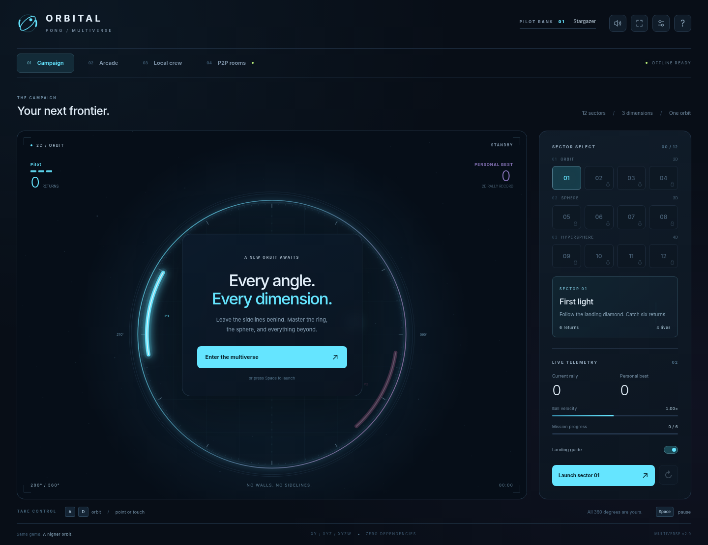

# Orbital Pong: Multiverse

> Same game. A higher orbit.

A full-circle arcade game with **real 2D, 3D, and 4D ball physics**, a twelve-sector campaign, local multiplayer, and peer-to-peer room networking. No runtime dependencies, accounts, build requirement, or game backend.

Move around the entire arena. Return when your paddle glows. Find the next dimension.



## Play

Open **`index.html`** in a full browser, choose a mode, and click **Launch** or press **Space**. Campaign, Arcade, Survival, and same-device multiplayer work offline.

The distributed HTML contains all styles and JavaScript. No external images, fonts, libraries, or audio downloads are needed. The files under `src/` are the editable source; they are not needed alongside the standalone HTML.

**Validation status:** local gameplay, controls, dimension-specific collisions, progression, and responsive layouts were tested. The P2P implementation and its protocol tests are included, but a real browser-to-browser connection could not be verified in the build environment because its browser policy exposed no WebRTC routes. See [Testing](#testing) and `TESTING.md` before treating internet multiplayer as production-validated.

## What is included

- **Three geometries:** an XY circle, an XYZ sphere, and an XYZW hypersphere rendered through a perspective projection. Z and W participate in collision detection, not just the artwork.
- **Twelve campaign sectors:** sequential unlocks, increasing difficulty, return targets, lives, and one-to-three-star completion ratings.
- **Arcade and Survival:** play against one to three computer pilots, or defend the arena alone with one life.
- **Two-to-four-player local games:** independent keyboard controls and multi-pointer touch input.
- **Two-to-four-player P2P rooms:** individual invite/reply exchanges, ready-up, host-selected settings, room chat, latency readouts, and synchronized match state.
- **A complete arcade interface:** landing predictions, optional depth assistance, sound effects, impact particles, trails, pause/resume, replay, fullscreen controls, pilot ranks, achievements, and progress backup/import.

## Dimensions that change the game

| Arena | Physics | Paddle control |
| --- | --- | --- |
| **2D Orbit** | Two-component position and velocity: XY. The ball stays inside a circular boundary until missed. | One angular axis around the full ring. |
| **3D Sphere** | Three-component position and velocity: XYZ. The paddle covers a cap on a sphere. | Orbit angle plus a depth angle. |
| **4D Hypersphere** | Four-component position and velocity: XYZW. Collision uses the four-dimensional distance and angular separation. | Orbit, depth, and fourth-axis phase angles. |

The 4D view is a **projection onto a normal two-dimensional screen**, not a literal four-dimensional display. Different positions can overlap visually in a projection. Use the landing diamond and the Z/W readouts to understand the next contact.

**Depth + phase assistance is on by default.** It steers the higher-dimensional angles toward the predicted contact while you control the orbit angle. Turn it off in the sidebar to control every angle manually. Off-center contact and paddle motion change the outgoing direction; higher-dimensional returns also introduce out-of-plane deflection.

## Modes and rules

### Campaign

Complete the sector's **total-return target** before losing all lives. Your total progress survives a missed return; the current rally resets. Clear sectors in order to unlock the next one. All dimensions remain immediately available in Arcade, Local crew, and P2P room settings.

| Sector | Name | Arena | Return target | Starting lives |
| --- | --- | --- | ---: | ---: |
| 01 | First light | 2D Orbit | 6 | 4 |
| 02 | Momentum | 2D Orbit | 10 | 3 |
| 03 | Afterglow | 2D Orbit | 13 | 3 |
| 04 | Escape velocity | 2D Orbit | 16 | 3 |
| 05 | A new axis | 3D Sphere | 6 | 4 |
| 06 | Parallax | 3D Sphere | 10 | 3 |
| 07 | Deep field | 3D Sphere | 13 | 3 |
| 08 | Event horizon | 3D Sphere | 16 | 3 |
| 09 | Fourth light | 4D Hypersphere | 6 | 4 |
| 10 | Phase shift | 4D Hypersphere | 10 | 3 |
| 11 | Beyond sight | 4D Hypersphere | 14 | 3 |
| 12 | Singularity | 4D Hypersphere | 18 | 3 |

A successful clear earns three stars with no misses, two with one miss, or one with two or more misses. Replaying a sector can improve its saved rating. Each return by the profile's pilot earns 10 XP; improving a sector rating earns 50 XP per newly earned star. Ranks advance every 300 XP.

### Arcade

Choose **Versus AI** for two to four total pilots, or **Survival** for one paddle and one life. Select a dimension and Easy, Normal, or Hard difficulty. Competitive matches support three, five, or seven starting lives.

### Local crew and P2P matches

Competitive games use **last-pilot-standing** rules rather than the original version's first-to-seven scoring.

Only the **glowing paddle** can make the next return. Dim paddles are inactive and cannot block the ball, even if they overlap. A successful return passes the turn to the next living pilot. A miss costs the active pilot one life. Pilots with no lives are eliminated; the last remaining pilot wins.

The circular or spherical rim is **not a wall**. An uncovered contact lets the ball escape.

## Controls

### Movement

| Pilot | Orbit angle | Depth Z, in 3D/4D | Phase W, in 4D |
| --- | --- | --- | --- |
| Solo, online, or local P1 | `A` / `D` | `W` / `S` | `Q` / `E` |
| Local P2 | Left / Right | Up / Down | Page Up / Page Down |
| Local P3 | `J` / `L` | `I` / `K` | `U` / `O` |
| Local P4 | `V` / `N` | `T` / `G` | `B` / `H` |

Left and Right also control your orbit in solo and online modes. Online players always use the first control set, regardless of their room seat.

**Mouse:** move the pointer over the arena to aim your paddle. In local games, the mouse controls P1.

**Touch:** touch near a living paddle to claim it, then drag. In local games, separate simultaneous touches claim separate paddles. In online games, your touch controls only your assigned paddle. Keep assistance on for simpler shared-touch play. With assistance off, depth/phase sliders are available for P1 or the local online pilot; additional local players can use their depth/phase keys.

Paddles accelerate and have a speed limit. Aiming does not teleport a paddle to the contact point.

### Match and interface controls

| Key | Action |
| --- | --- |
| `Space` | Launch, pause, resume, or continue after a result. |
| `Esc` | Pause/resume; closes an open dialog using browser behavior. |
| `R` | Restart the current match. Online restart is host-only and asks for confirmation. |
| `M` | Toggle sound. |
| `F` | Toggle fullscreen, where the browser permits it. |

In a P2P match, **only the host can pause or restart the shared simulation**. The host tab automatically pauses the match when it loses focus or becomes hidden. A backgrounded guest stops sending movement; it does not pause everyone else's match.

## Create a P2P room

No signaling service or game server is included. Browser connection descriptions are exchanged manually instead.

1. **Host:** open **P2P rooms -> Open room console**. Choose a callsign and route, then click **Create room & invite**. Send the complete generated invite to one guest.
2. **Guest:** open the same game, choose **Join a room**, paste the host's invite, and click **Generate my reply**. Send the complete reply back to the host.
3. **Host:** paste that reply and click **Accept guest reply**. Keep both tabs open until the connection is shown as connected.
4. **Guest:** click **Ready up**. The host selects the arena, difficulty, and lives, then clicks **Launch match**.

For a third or fourth pilot, the host clicks **Invite another pilot** and repeats the exchange. **Each guest must have a unique invite.** Remove unused pending invitations before launching; all invited pilots must be connected and ready.

Codes can be copied or saved as text files, and received code files can be loaded into the exchange panel. Invites and replies expire after an hour. The six-character room label identifies the room for humans; **typing that label alone cannot discover or join it**.

### What "without a server" means

| Route | External infrastructure used by the game | Suitable circumstances |
| --- | --- | --- |
| **Direct / LAN** | None. `iceServers` is empty. | Same device or compatible local networks that expose reachable peer routes. |
| **Internet / STUN** | Public Google STUN discovery endpoints. No game/signaling service and no TURN relay. | Networks where discovery produces a usable direct internet path. |

STUN is still an external server, even though it is not a gameplay server. It helps discover network routes; it does not host the match. Choose **Direct / LAN** when zero external discovery infrastructure is a requirement.

WebRTC still needs an initial exchange of connection metadata. In this game, **you are the signaling channel** when you share the invite and reply through your chosen method. The game does not contact a messaging platform itself.

**There is no TURN fallback.** Some NATs, VPNs, firewalls, managed browsers, mobile carriers, and isolated Wi-Fi networks cannot establish a direct path. Consequently, arbitrary internet connectivity cannot be guaranteed by this server-free design. A route-blocked browser gets an explanatory error instead of an unusable invitation.

### Room behavior and limits

The host is also a player. Its browser runs the authoritative simulation and sends complete snapshots to up to three guests. This is a **peer-hosted star**, not a full mesh and not lockstep simulation.

The host must remain connected. There is no host migration, public lobby directory, account system, automatic matchmaking, or automatic reconnection after a closed session. Create a new invitation to reconnect. A departing guest is eliminated from the current match; if multiple pilots remain, the host can resume the paused match. If the host departs, the room ends.

Open the game in a full browser, not an embedded preview. Browser policies can disable networking, clipboard access, fullscreen, or storage independently. Hosting the file on a static HTTPS site is another delivery option; static file delivery does not add a game backend.

### Privacy and trust

Connection codes contain SDP, ICE credentials, and network metadata. Share them privately with intended players; do not commit them to a public repository. Only data channels are used: the game does not request camera or microphone access.

Peer traffic uses WebRTC's encrypted transport. Manual signaling does not independently verify who sent a code; exchange it through a channel you trust. Guests trust the host's simulation. Packet bounds and input validation improve robustness, but this is not a tamper-proof competitive ranking system.

Room chat is session-only. There are no analytics, remote chat logs, or account uploads in the game code. Local progress is editable by its owner and is not a global leaderboard.

## Progress and preferences

The browser stores sector stars, per-dimension rally records, rank XP, achievements, callsign, sound, landing-guide preference, assistance, and motion preference in `localStorage`, when allowed.

Use **Pilot settings -> Export progress** to back up progress as JSON, and **Import progress** to restore it elsewhere. Import asks before replacing the current profile and validates the file's structure and values.

Records are local to the browser and origin; they are not automatically synchronized across devices. A running match and a live room connection are not saved across reloads. When storage is blocked, gameplay and in-memory progress still work, but exporting a backup is necessary to keep progress beyond the session.

## Source structure

```text
orbital-pong-multiverse/
|-- index.html                 # Standalone playable release
|-- README.md                  # Game and networking instructions
|-- TESTING.md                 # Observed results and validation limits
|-- CHANGELOG.md               # Changes from the original game
|-- github-description.txt     # Repository description
|-- build.py                   # Standard-library-only HTML bundler
|-- requirements-dev.txt       # Browser-test dependency, not a game dependency
|-- src/
|   |-- shell.html             # Interface markup
|   |-- style.css              # Responsive arcade interface
|   |-- engine.js              # Pure N-dimensional physics and game rules
|   |-- network.js             # WebRTC connections and room protocol
|   |-- render.js              # Canvas projection and visual effects
|   `-- app.js                 # Input, progression, UI, and networking integration
|-- tests/
|   |-- engine.test.cjs        # Physics, rules, serialization, and code parsing
|   |-- protocol.test.cjs      # Explicitly transport-mocked protocol tests
|   `-- browser_smoke.py       # UI tests and optional actual four-peer checks
|-- reports/                   # Recorded build-environment test results
`-- docs/                      # Preview screenshot
```

### Rebuild

Edit `src/` and run:

```sh
python build.py
```

This overwrites `index.html` with a fresh self-contained build. Node, npm, and a backend are not needed to build or play the game. Keep `index.html` in sync when publishing changes to the source.

### Optional development server

For testing a normal local origin rather than directly opening a file:

```sh
python -m http.server 8000 --bind 127.0.0.1
```

Open `http://localhost:8000/`. This serves static files only; it does not run the multiplayer simulation or signaling.

## Technical notes

The simulation uses a fixed **1/120-second timestep** and normalized arena coordinates. It solves the ball's future intersection with the circular/spherical/hyperspherical contact boundary. Catching depends on angular separation between the contact normal and the active paddle direction, including a small ball-radius allowance.

The renderer uses Canvas 2D and `requestAnimationFrame`. Three-dimensional points undergo a camera rotation and perspective projection. Four-dimensional points are first projected into three dimensions using their W coordinate and then onto the canvas. Rendering is separate from the dimension-independent simulation.

Multiplayer uses two WebRTC data channels per guest: reliable, ordered messages for room control, ready state, chat, match start, and immediate pause updates; and unordered messages with no retransmissions for inputs and complete snapshots. Host physics stays at 120 Hz, while network input/snapshot cadence is approximately 30 Hz. Guests use short visual interpolation and limited local paddle prediction. The host alone decides collisions, lives, and results.

Remote movement expires when input becomes stale. Sequence numbers reject older snapshots, and a fresh match epoch prevents late packets from an earlier match from overwriting a rematch. Signaling codes are size-limited and checked for version, type, room, seat, nonce, and expiry. ICE gathering completes before the one-shot code is generated.

### Customize

Change `LEVELS` and `DIFFICULTIES` in `src/engine.js` to tune goals, starting speeds, speed caps, capture angles, lives, and AI behavior. Change `COLORS` and CSS variables together to restyle player colors. `src/network.js` contains room limits and the optional STUN configuration.

The build is deliberately capped at four players. Increasing that cap requires coordinating the room protocol, packet validation, colors, local control mappings, roster UI, and network capacity rather than changing a single number.

## Testing

Run the dependency-free engine/protocol checks with Node.js:

```sh
node --test tests/*.test.cjs
```

For browser testing, install the development-only requirements and a Playwright browser, then run:

```sh
python -m pip install -r requirements-dev.txt
python -m playwright install chromium
python tests/browser_smoke.py
```

To test a normally loaded game origin and require successful real P2P connections:

```sh
python tests/browser_smoke.py --url http://localhost:8000/ --require-p2p
```

A system Chromium can be selected with `--chromium /path/to/chromium`. The default browser test loads the HTML into blank browser documents; this exercises the interface but does not verify real-origin storage or navigation. A blocked ICE route is reported as **SKIP**, not a passed connection test. `--require-p2p` turns that condition into failure.

The real-connection branch creates one host and three independent guest browser contexts, exchanges real offers and replies, checks ready-up, starts a four-player 4D match, transmits input, synchronizes pause, exchanges chat, and closes the room. Its availability depends on the test browser exposing usable routes. Also test on separate physical devices and different internet networks before an online release; local-loopback success does not establish universal NAT compatibility.

## Accessibility and browser notes

Controls have labels, keyboard focus indicators, status announcements, and reduced-motion adjustments. Fullscreen and sound fail gracefully when unavailable. The game remains visual, spatial, and timing-based; it is not fully screen-reader playable.

Use a browser with Canvas 2D, Pointer Events, `ResizeObserver`, and WebRTC data-channel support for online play. The build environment's browser checks used Chromium; cross-browser and physical mobile-device validation remain recommended rather than claimed as completed.

## References

The networking design follows the primary API documentation:

- [WebRTC: getting started with peer connections](https://webrtc.org/getting-started/peer-connections)
- [MDN: using WebRTC data channels](https://developer.mozilla.org/en-US/docs/Web/API/WebRTC_API/Using_data_channels)
- [MDN: ICE gathering state](https://developer.mozilla.org/en-US/docs/Web/API/RTCPeerConnection/iceGatheringState)

## Contributions and licensing

For bug reports, include the browser, device, mode, dimension, assist setting, and reproduction steps. For connection failures, also include Direct/LAN versus Internet/STUN and the visible status message, but do not post full connection codes publicly.

Keep the standalone build and tests current when changing the source. No `LICENSE` file is included; the repository owner has not selected a license for this package.
